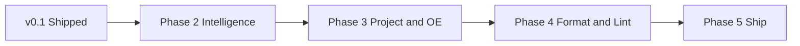

# ABL Helper

OpenEdge ABL language support for Visual Studio Code: **syntax highlighting**, **outline**, **formatting**, and **syntax checking** (via local OpenEdge install).

## Features

| Feature | Description |
|--------|-------------|
| Syntax highlighting | TextMate grammar for `.p`, `.cls`, `.w`, `.i` plus research-driven injection (OpenEdge 12.8 reserved keywords, preprocessors) |
| Outline | Document symbols from [tree-sitter-abl](https://github.com/eglekaz/tree-sitter-abl) (native or WASM) |
| Autocomplete | ABL keywords + symbols from the current file (no database schema yet) |
| Snippets | Common constructs — procedure, class, method, `defvar`, `foreach`, include, etc. |
| Format document | Trim trailing whitespace; optional keyword upper/lower; experimental tree-sitter pass (off by default) |
| Check syntax | Runs `_progres -b -p` with a helper procedure; maps compiler listing to diagnostics |

## Requirements

- **VS Code** 1.85+
- **Check syntax only**: OpenEdge 11.7+ with `_progres` on `PATH` via `DLC` (developer license). Set `ablHelper.dlcPath` or the `DLC` environment variable.
- **Outline / parsing**: No OpenEdge required if `wasm/tree-sitter.wasm` and `wasm/tree-sitter-abl.wasm` are present (included in repo; refresh with `npm run fetch:wasm`).

## Settings

| Setting | Default | Description |
|---------|---------|-------------|
| `ablHelper.dlcPath` | `""` | OpenEdge DLC root (else `DLC` env) |
| `ablHelper.propath` | `[]` | PROPATH entries; workspace folder appended |
| `ablHelper.parameterFiles` | `[]` | `-pf` files |
| `ablHelper.workingDirectory` | `${workspaceFolder}` | CWD for OpenEdge |
| `ablHelper.batchExecutable` | `_progres` | Batch executable name |
| `ablHelper.format.keywordCaseOnFormatDocument` | `none` | `none` / `upper` / `lower` |
| `ablHelper.format.trimTrailingWhitespace` | `true` | Trim on format |
| `ablHelper.format.enableTreeSitterPass` | `false` | Experimental Tier B formatting |
| `[abl].editor.formatOnSave` | `false` | Disabled by default — format legacy code cautiously |

## Commands

- **ABL Helper: Check Syntax** — compile-check current file
- **ABL Helper: Format Keywords (Upper/Lower Case)**
- **ABL Helper: Trim Trailing Whitespace**
- **ABL Helper: Show Output**
- **ABL Helper: Reload Tree-sitter Parser**

## Formatting risk

Automated formatting can change large legacy sources in ways that are hard to review. Prefer **Format Selection** or keyword-only commands until you trust results on your codebase. Do not enable `editor.formatOnSave` for ABL until you have verified behavior.

## Coexistence with other ABL extensions

You can install **ABL Helper** alongside [Riverside OpenEdge ABL LSP](https://marketplace.visualstudio.com/items?itemName=RiversideSoftware.openedge-abl-lsp) or [ZExt](https://marketplace.visualstudio.com/items?itemName=EzequielGandolfi.openedge-zext). Disable overlapping features (format on save, duplicate grammars) in settings if two extensions fight over the same language.

This extension does **not** provide a full language server, debugger, or compile/deploy pipeline — it focuses on lightweight highlighting, outline, Tier A/B formatting, and a simple check-syntax path.

## Feature checklist

Legend: **Done** = available in v0.1.x · **Planned** = on the roadmap below · **Out of scope** = intentionally deferred (use Riverside LSP, ZExt, CABL, etc.)

### Core (plan v1 goals)

| Status | Feature |
|--------|---------|
| Done | Syntax highlighting (`.p`, `.cls`, `.w`, `.i`) — chriscamicas TextMate grammar + [12.8 research injection](docs/syntax-highlighting-research.md) |
| Done | Editor ergonomics — comments, brackets, `//#region` folding, basic indent rules |
| Done | Document outline — tree-sitter-abl symbols (procedure, class, method, etc.) |
| Done | Check syntax — `_progres` subprocess, Problems panel, **ABL Helper** output channel |
| Done | Tier A formatting — trim trailing whitespace; keyword upper/lower commands |
| Done | Tier B formatting (experimental) — minimal tree-sitter pass via `ablHelper.format.enableTreeSitterPass` |
| Done | Settings — DLC, PROPATH, parameter files, working directory |
| Planned | Richer diagnostics — map individual compiler warnings (e.g. 18494 abbreviated keywords) from listing |
| Planned | Tier B formatting — assign / if / case / for / block coverage (Baltic-style, settings-driven) |
| Planned | Expand reserved/statement keyword lists from full [Keyword Index](https://docs.progress.com/bundle/openedge-abl-reference-128/page/Keyword-Index.html) |

### Language intelligence (typical LSP / ZExt / Camicas)

| Status | Feature |
|--------|---------|
| Done | Autocomplete — keywords + in-file symbols (tree-sitter) |
| Planned | Autocomplete — tables, fields (database / dictionary; deferred) |
| Planned | Go to definition / references (includes, procedures, classes) |
| Planned | Hover — schema, variable, method signatures |
| Planned | Rename symbol |
| Done | Code snippets (`snippets/abl.code-snippets`) |
| Planned | Include file suggestions on `{` |
| Out of scope | Full Java language server (see [Riverside openedge-abl-lsp](https://marketplace.visualstudio.com/items?itemName=RiversideSoftware.openedge-abl-lsp)) |

### Build, run, debug (Riverside / ZExt / Camicas)

| Status | Feature |
|--------|---------|
| Planned | Compile current file (beyond check-syntax; xref / listing options) |
| Planned | Run procedure (`_progres` / prowin, batch and interactive) |
| Planned | Deploy source or r-code |
| Planned | `openedge-project.json` (or `.abl-helper.json`) — build paths, DB connections, profiles |
| Planned | Rebuild project / background compile queue |
| Out of scope | Debugger (legacy + PASOE), `launch.json` templates |
| Out of scope | AppBuilder, Data Dictionary, Speedscript pipeline, compile hooks |

### Static analysis (CABL / SonarLint research)

| Status | Feature |
|--------|---------|
| Planned | Lightweight lint rules inspired by [CABL research](docs/research-cabl-sonarlint-validations.md) — e.g. ClumsySyntax-style `END` + period, require-full-keywords |
| Planned | Dictionary / schema awareness for checks and completion |
| Out of scope | SonarQube connected mode, commercial CABL rule packs, metrics/CPD/coverage UI |

### Other extensions’ specialties

| Status | Feature |
|--------|---------|
| Planned | Per-construct formatter settings and optional per-file overrides |
| Out of scope | Class browser tree + `catalog.json` ([Consultingwerk Class Browser](https://marketplace.visualstudio.com/items?itemName=ConsultingwerkApplicationModernizationSolutionsLtd.classbrowser)) |
| Out of scope | Extension API for other tools (`getProjectInfo`, `compile`, `getSchema`, …) |

### Tooling and quality (repo)

| Status | Feature |
|--------|---------|
| Done | TypeScript-only source enforcement (`src/`, `scripts/`; ESLint + CI) |
| Done | Unit tests — symbols, check-syntax parser, grammar scopes |
| Done | ADE corpus smoke tests (`npm run test:corpus`, CI job) |
| Done | GitHub Actions — compile, lint, test, package VSIX |
| Planned | Publish to VS Code Marketplace |
| Planned | Broader ADE corpus assertions (formatter idempotence on allowlist) |

## Roadmap

Phased work after v0.1.0. Order may shift; **Out of scope** items stay external unless goals change.



### Phase 2 — Language intelligence

- ~~Autocomplete: keywords + in-file symbols~~ (v0.2)
- Autocomplete: database tables/fields (dictionary / `.df` — when configured)
- Go to definition for includes and local symbols
- Hover for tables/fields where schema is available
- Code snippets for common ABL patterns

### Phase 3 — Project model and OpenEdge workflows

- Read `openedge-project.json` / `.abl-helper.json` (PROPATH, DB, build dirs)
- Compile and run commands with keyboard shortcuts
- Optional deploy hooks (source / r-code)
- Startup procedure and improved check-syntax project context

### Phase 4 — Formatting and lint depth

- Expand Tier B tree-sitter formatting (assign, if, case, for, block, temp-table, using)
- Formatter settings in VS Code (`ablHelper.format.*` per construct)
- Rules from [OpenEdge 12.8 research](docs/research-openedge-abl-reference-128.md) and [CABL research](docs/research-cabl-sonarlint-validations.md) as diagnostics where feasible without SonarQube

### Phase 5 — Release hardening

- Marketplace publish, changelog discipline, compatibility matrix (OE 11.7 / 12.2 / 12.8)
- ADE corpus: pin bumps, optional formatter regression allowlist
- Documentation for coexistence with Riverside LSP / ZExt (which features to disable)

### Explicitly not planned (v1)

- Full LSP server, debugger, PASOE attach, class browser, SonarQube/CABL integration — use the specialized extensions listed under [Coexistence](#coexistence-with-other-abl-extensions).

## Building the extension

**Prerequisites:** [Node.js](https://nodejs.org/) 20+ and npm.

| Goal | Command |
|------|---------|
| Install dependencies | `npm ci` |
| Full build (grammar + extension) | `npm run build` |
| Compile TypeScript only | `npm run compile` |
| Watch while editing | `npm run watch` |
| Type-check without emit | `npm run typecheck` |
| Package installable `.vsix` | `npm run package` |
| Run tests | `npm test` |

`npm run build` runs `grammar:build` (regenerates `syntaxes/research-injection.tmLanguage.json` from `resources/*.txt`) then `compile` (esbuild → `out/extension.js` and copies `resources/` into `out/resources/`). `npm run package` runs `build` first, then produces `abl-helper-<version>.vsix` in the repo root.

**Run from source (F5):** Open this folder in VS Code, run `npm run build`, choose **Run Extension** from the Run and Debug view (see `.vscode/launch.json`).

**Install the VSIX:** Extensions → `...` → **Install from VSIX...** → select the `.vsix` from `npm run package`.

Native `tree-sitter-abl` is optional for development; the extension falls back to committed WASM under `wasm/`. On Windows you may run `npm rebuild tree-sitter-abl` after `npm ci` if you want the native parser.

## Development

Extension source under `src/` and repo scripts under `scripts/` are **TypeScript only** (`.ts`). Do not add `.js`, `.jsx`, or `.mjs` there. Root tooling (`esbuild.config.ts`, `eslint.config.ts`, `scripts/*.ts`) runs via [tsx](https://github.com/privatenumber/tsx) without a separate compile step. Bundled extension output lives in `out/` (gitignored; `out/extension.js` from esbuild).

```bash
npm ci
npm run build
npm test
npm run typecheck              # src + tooling (tsconfig.json + tsconfig.tools.json)
npm run check:typescript-only  # CI guard: no .js/.jsx/.mjs under src/ or scripts/
```

See [docs/syntax-highlighting-research.md](docs/syntax-highlighting-research.md) for how Progress 12.8 reference notes map to TextMate scopes.

### ADE corpus tests

Uses [progress/ADE](https://github.com/progress/ADE) (`release-12.8.x`, Apache-2.0) as a read-only test corpus — **not** bundled in the VSIX.

```bash
npm run corpus:sync    # shallow clone into corpus/ade (~large download)
npm run test:corpus    # parse smoke on deterministic sample
```

CI checks out ADE at a pinned commit (see `.github/workflows/ci.yml`).

## License

MIT — see the LICENSE and NOTICE files in this repository for third-party attributions.
